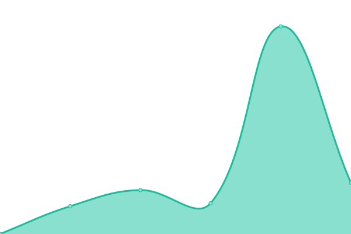
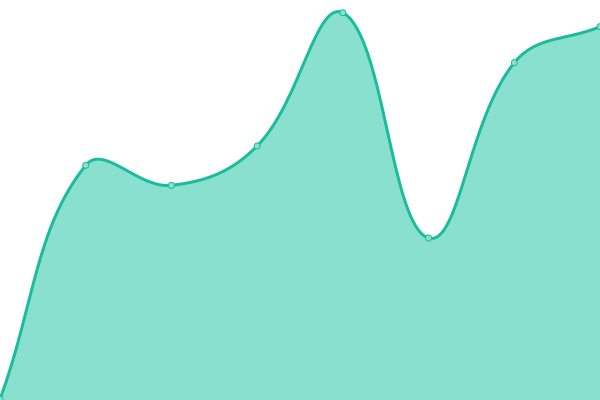

# [📈 Live Status](https://DavidBaezDbz.github.io/DavidBaezDbz): <!--live status--> **🟧 Partial outage**

This repository contains the open-source uptime monitor and status page for [DBZDavidBaez](https://davidbaezdbz.github.io/), powered by [Upptime](https://github.com/upptime/upptime).

With [Upptime](https://upptime.js.org), you can get your own unlimited and free uptime monitor and status page, powered entirely by a GitHub repository. We use [Issues](https://github.com/DavidBaezDbz/DavidBaezDbz/issues) as incident reports, [Actions](https://github.com/DavidBaezDbz/DavidBaezDbz/actions) as uptime monitors, and [Pages](https://DavidBaezDbz.github.io/DavidBaezDbz) for the status page.

<!--start: status pages-->
<!-- This summary is generated by Upptime (https://github.com/upptime/upptime) -->
<!-- Do not edit this manually, your changes will be overwritten -->
<!-- prettier-ignore -->
| URL | Status | History | Response Time | Uptime |
| --- | ------ | ------- | ------------- | ------ |
|  [Heon](https://www.heon.com.co/inicio) | 🟩 Up | [heon.yml](https://github.com/DavidBaezDbz/uptimesites/commits/HEAD/history/heon.yml) | 

 1678ms
     
 | 

<a href="https://DavidBaezDbz.github.io/uptimesites/history/heon">100.00%</a>
    

|  [MedcorvesaludQa](https://medcorvesaludqa.heon.com.co/) | 🟥 Down | [medcorvesalud-qa.yml](https://github.com/DavidBaezDbz/uptimesites/commits/HEAD/history/medcorvesalud-qa.yml) | 

 730ms
     
 | 

<a href="https://DavidBaezDbz.github.io/uptimesites/history/medcorvesalud-qa">2.20%</a>
    

|  [Foscal](http://www.foscal.com.co/) | 🟩 Up | [foscal.yml](https://github.com/DavidBaezDbz/uptimesites/commits/HEAD/history/foscal.yml) | 

 402ms
     
 | 

<a href="https://DavidBaezDbz.github.io/uptimesites/history/foscal">100.00%</a>
    

|  [Esalud](https://www.esaludecopetrol.com/) | 🟥 Down | [esalud.yml](https://github.com/DavidBaezDbz/uptimesites/commits/HEAD/history/esalud.yml) | 

 0ms
     
 | 

<a href="https://DavidBaezDbz.github.io/uptimesites/history/esalud">100.00%</a>
    

<!--end: status pages-->

[**Visit our status website →**](https://DavidBaezDbz.github.io/DavidBaezDbz)

## 📄 License

- Powered by: [Upptime](https://github.com/upptime/upptime)
- Code: [MIT](./LICENSE) © [DBZDavidBaez](https://davidbaezdbz.github.io/)
- Data in the `./history` directory: [Open Database License](https://opendatacommons.org/licenses/odbl/1-0/)
